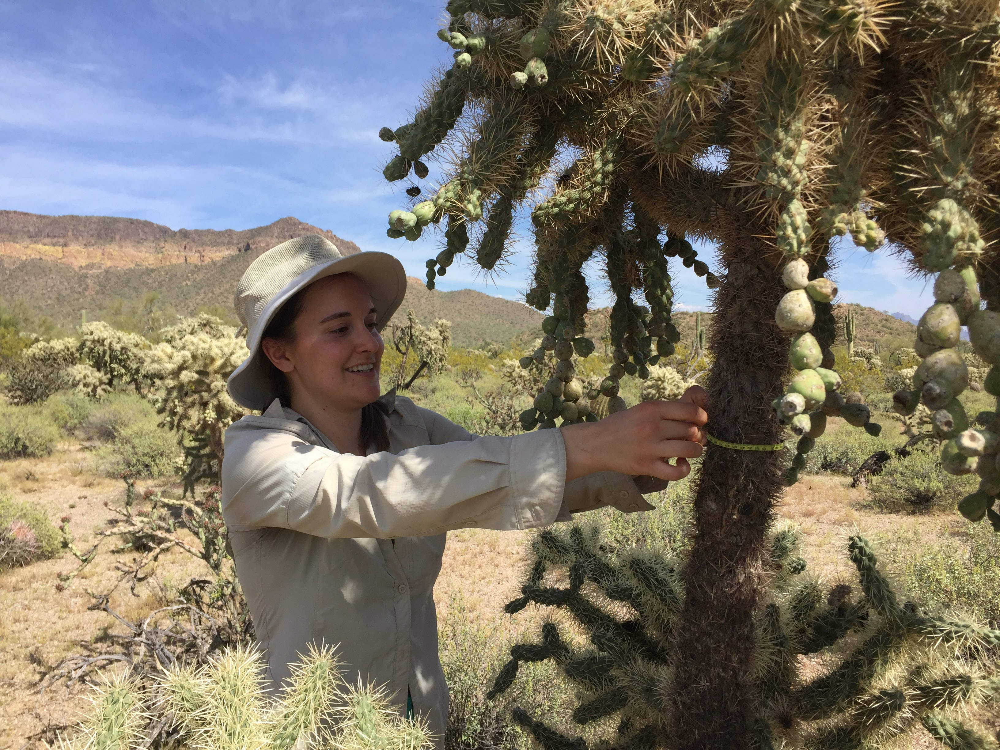

```{r setup, include=FALSE}
library(knitr)
knitr::opts_chunk$set(echo = FALSE)
```

Hello! My name is Megan Wheeler and I am a third year PhD student at Arizona State University in the [Hall Lab](https://halllab.asu.edu/), which has a broad focus on the ecology of native and managed ecosystems.


I am very interested in how the decisions people make affect ecological outcomes, and for my dissertation work am focusing on how urban and urban-influenced plant communities change over time. I find urban ecosystems especially interesting because they are where most people now live and work, they have disproportionately large impacts on Earth's ecology and biogeochemistry, and they are ideal places to understand how people interact with and manage ecosystems.


Most of the time, I do work with existing datasets, which are often larger or cover longer time periods than data I could collect myself. Some of my current projects use data from the [Central Arizona Long Term Ecological Research project](https://sustainability.asu.edu/caplter/), an NSF-funded project focused on collecting long term ecological data in the Phoenix metropolitan area. While most of my work is done in front of a computer, I do get out into the desert once in a while! 




Currently, I'm preparing for summer field work identifying plant species in front yards around Phoenix for my Residential Yard Dynamics project, which will be part of my dissertation work. This has entailed lots of time browsing the Home Depot nursery department to learn common landscaping plants.


I'm also taking a class to learn to identify common Arizona plant families.


Contact me at mmwheele@asu.edu.

Follow me on Twitter @megmwheeler
