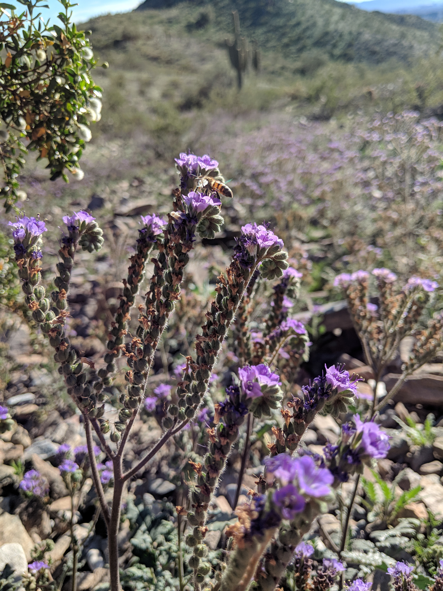

```{r setup, include=FALSE}
library(knitr)
knitr::opts_chunk$set(echo = FALSE)
```

Contact me: mmwheele@asu.edu

On Twitter: @[megmwheeler](https://twitter.com/megmwheeler)

<br>

Hello! My name is Megan Wheeler and I am a fourth year PhD student at Arizona State University in the [Hall Lab](https://halllab.asu.edu/), which has a broad focus on the ecology of native and managed ecosystems.


I am interested in how the decisions people make affect ecological outcomes, and for my dissertation work I am focusing on how urban and urban-influenced plant communities change over time. I find urban ecosystems especially interesting because they are where most people now live and work, they have disproportionately large impacts on Earth's ecology and biogeochemistry, and they are ideal places to understand how people interact with and manage ecosystems.


Most of the time, I work with existing datasets, which are often larger or cover longer time periods than what I could collect myself. Some of my current projects use data from the [Central Arizona Long Term Ecological Research project](https://sustainability.asu.edu/caplter/), an NSF-funded project focused on understanding long term ecological trends in the Phoenix metropolitan area. As part of this work, I am investigating how water and nutrient availability affect annual plant communities (wildflowers!) in the Sonoran Desert.





Before coming to ASU, I began work with an NSF-funded MacroSystems Biology project, [Ecological Homogenization of Urban America](http://ecologicalhomogenization.com/). As part of this work I studied the [composition of residential lawns across the US to test the urban homogenization hypothesis](https://www.sciencedirect.com/science/article/pii/S0169204617301081), and found that lawn species composition is quite similar across the country, and that spontaneous species (those that grow on their own rather than being planted) were actually more similar than were planted turfgrass species. I've continued to work with this group as a graduate student, comparing residential yards of different types in Phoenix and across the country. 

At ASU, I also work with the [Decision Center for a Desert City](https://sustainability.asu.edu/dcdc/) on a project seeking to understand changes in Phoenix residential landscaping over time, and the implications these changes have for urban water use. Outdoor landscape irrigation is a very large component of overall residential water use, and so understanding why people choose to have or remove water-intensive landscaping has applications in water conservation and policy planning.

***

#Publications and Presentations

### 2019

- Bergman, D.N., **Wheeler, M.M.**, K.L. Larson, and S.J. Hall. “Do Attitudes
Towards Native Flora Predict Landscaping Choices in Privately Managed Urban Landscapes?” Poster presented at the Central Arizona-Phoenix LTER All Scientists Meeting, Tempe, AZ.
- Fleeger, M., K.L. Larson, **Wheeler, M.M.**, R. Andrade, and S.J. Hall. “Attitudes toward Pollinators in Residential Landscapes of Metropolitan Phoenix, Arizona.” Poster presented at the Central Arizona-Phoenix LTER All Scientists Meeting, Tempe, AZ.

### 2018

- D. Locke, M. Avolio, T.L.E. Trammell, R. Roy Chowdhury, J. M. Grove, J. Rogan, D.G. Martin, N. Bettez, J. Cavender-Bares, P.M. Groffman, S.J. Hall, J.B. Heffernan, S.E. Hobbie, K.L. Larson, J.L. Morse, C. Neill, K.C. Nelson, L.A. Ogden, J. O’Neil-Dunne, D.E. Pataki, W.D. Pearse, C. Polsky, and **M.M. Wheeler**. A multi-city comparison of front and backyard differences in plant species diversity and nitrogen cycling in residential landscapes. Landscape and Urban Planning 178:102-111. [Link to article](https://www.sciencedirect.com/science/article/pii/S0169204618304353)
- **Wheeler, M.M.**, K.L. Larson, R. Andrade, and S.J. Hall. “Landscape change and the adoption of water-conserving desert landscapes in Phoenix residential yards.” Poster presented at the ASU Institute for Social Science Research Fall 2018 Poster Competition, Tempe, AZ.
- **Wheeler, M.M.** and S.R. Earl. “Using mobile apps for easy, consistent cross-site or long-term data collection.” Poster presented at the LTER All Scientists’ Meeting, Pacific Grove, CA.
- **Wheeler, M.M.**, K.L. Larson, E.M. Cook, and S.J. Hall. “Land managers drive plant community dynamics: A case study of change over time in Phoenix residential neighborhoods.” Seminar presented at the Ecological Society of America Meeting, New Orleans, LA.
- **Wheeler, M.M.**, S.L. Collins, N.B. Grimm, C. Clark, R.A. Sponseller, E.M. Cook, and S.J. Hall. “Global change in the desert: Effects of increased nitrogen on diverse annual plant communities.” Poster presented at the Central Arizona-Phoenix LTER All Scientists Meeting, Tempe, AZ.
- Ribiero, C., **M.M. Wheeler**, L. Steger, and S.J. Hall. “Shrubs alter patterns of inorganic nitrogen availability in native desert parks across metropolitan Phoenix.” Poster presented at the Central Arizona-Phoenix LTER All Scientists 
- Beauclaire Reyes, C., A. Bailey, L. Steger, **M.M. Wheeler**, and S.J. Hall. “Plant species diversity and community composition of alternative yards in Phoenix, AZ.” Poster presented at the Central Arizona-Phoenix LTER All Scientists Meeting, Tempe, AZ.

### 2017

- **Wheeler, M.M.**, C. Neill, P.M. Groffman, M. Avolio, N. Bettez, J. Cavender-Bares, R.R. Chowdhury, L. Darling, M. Grove, S.J. Hall, J.B. Heffernan, S.E. Hobbie, K.L. Larson, J.L. Morse, K.C. Nelson, L.A. Ogden, J. O’Neil-Dunne, D.E. Pataki, C. Polsky, M. Steele, and T.L.E. Trammell. Continental-scale homogenization of residential lawn plant communities. Landscape and Urban Planning 165: 54-63. [Link to article](https://www.sciencedirect.com/science/article/pii/S0169204617301081)
- **Wheeler, M.M.**, S.L. Collins, N.B. Grimm, C. Clark, R.A. Sponseller, and S.J. Hall. “Global change in the desert: Effects of increased nitrogen on diverse annual plant communities.” Poster presented at the Ecological Society of America Meeting, Portland, OR.
- **Wheeler, M.M.**, E.R. Vivoni, and S.J. Hall. “Evaluation of a soil water model to improve outdoor water use recommendations in an arid city.” Poster presented at the Central Arizona-Phoenix LTER All Scientists Meeting, Tempe, AZ.

### 2016

- **Wheeler, M.M.**, M.M. Dipman, T.A. Adams, A.V. Ruina, C.R. Robins, W.M. Meyer III. Carbon and nitrogen storage in California sage scrub and non-native grassland habitats. Journal of Arid Environments 129: 119-125. [Link to article](https://www.sciencedirect.com/science/article/pii/S0140196316300234)
- **Wheeler, M.M.**, J. Learned, H. Heavenrich, and S.J. Hall. “Regional Patterns and Homogenization of Residential Yard Soil Moisture in US Cities.” Poster presented at the INTERFACE Frontiers in Terrestrial Climate Feedbacks Workshop, St. Pete’s Beach, FL.

### 2015

- **Wheeler, M.M.**, C. Neill, E. Loucks, A. Weiler, B. Von Holle, M. Pelikan, and T. Chase. Vegetation removal and seed addition contribute to coastal sandplain grassland establishment on former agricultural fields. Restoration Ecology 23: 539-547. [Link to article](https://onlinelibrary.wiley.com/doi/full/10.1111/rec.12253)
- Neill, C., **M.M. Wheeler**, E. Loucks, A. Weiler, B. Von Holle, M. Pelikan, and T. Chase. Influence of soil properties on coastal sandplain grassland establishment on former agricultural fields. Restoration Ecology 23: 531-538. [Link to article](https://onlinelibrary.wiley.com/doi/full/10.1111/rec.12196)
- **Wheeler, M.M.**, C. Neill, P.M. Groffman, M. Grove, N. Bettez, J. Cavender-Bares, J.B. Heffernan, S.J. Hall, S.E. Hobbie, K.L. Larson, J.L. Morse, K.C. Nelson, L.A. Ogden, J. O’Neil-Dunne, D.E. Pataki, C. Polsky, R.R. Chowdhury, T. Trammell, M. Steele, W.D. Pearse, L. Darling, and M. Avolio. “Continental-scale Homogenization of US Urban Lawn Vegetation.” Seminar presented at the Ecological Society of America Annual Meeting, Baltimore, MD.

### 2014

- Meyer III, W.M., W.J. Staubus, **M.M. Wheeler**, M.M. Dipman, and D.M. Spear. “Conservation Importance of Native Coastal Sage Scrub and Non-native Grassland Habitat Patches in Urban/Suburban Los Angeles County, California, USA.” Seminar presented at the Ecological Society of America Annual Meeting, Sacramento, CA.
- **Wheeler, M.M.** and C. Neill. “Effects of Vegetation Removal, Seed Limitation and Soil Chemistry on Sandplain Grassland Creation on Former Agricultural Fields.” Seminar presented at the Society for Ecological Restoration New England Chapter Regional Conference, Amherst, MA.