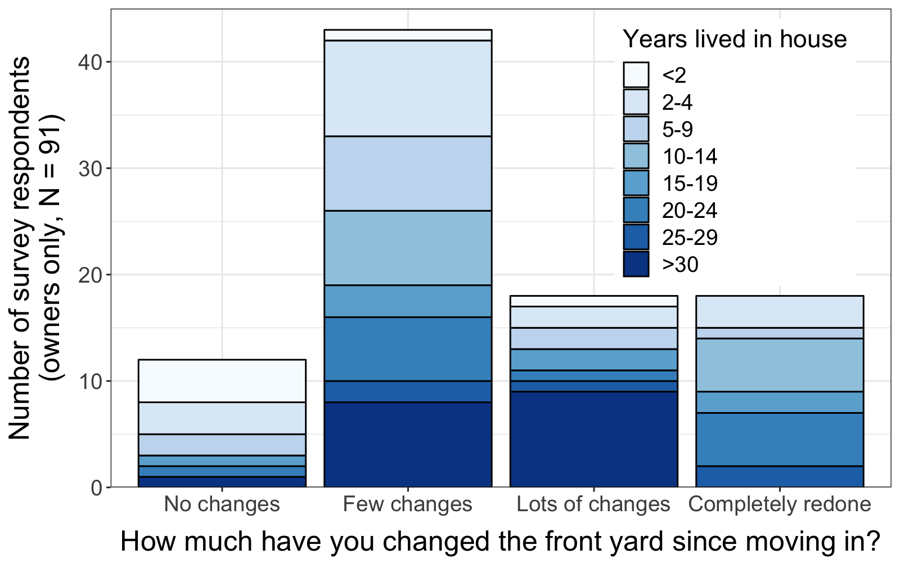
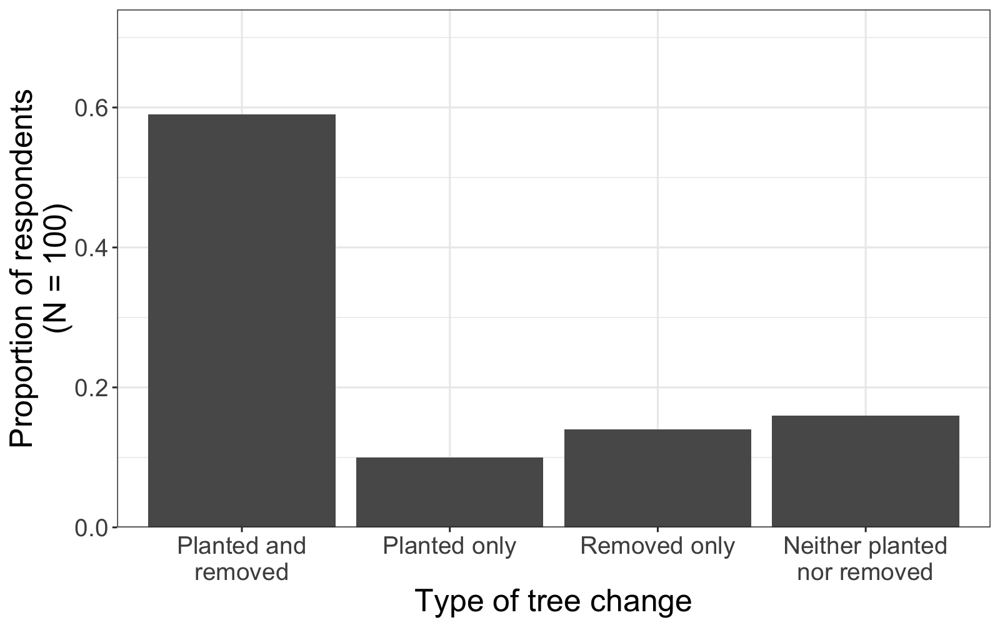

In August, 2018, I presented early findings from this work at the Ecological Society of America Annual Meeting in New Orleans in a talk entitled ["Land managers drive plant community dynamics: A case study of change over time in Phoenix residential neighborhood"](https://eco.confex.com/eco/2018/meetingapp.cgi/Paper/72818). In these early analyses, I found that residents overall reported making lots of changes to their yards, and that these changes were reflected by dissimilarity in the plant communities we observed.

<figure>
  
  <figcaption>Figure 1. Resident-reported changes made in the front yard in the time they had lived at that address. We observed that most people had made at least a few changes, with the smallest group of respondents reporting having made no changes at all. Most residents who had not made changes had not yet lived at that address for very long.</figcaption>
</figure>

 

While I expected to see relatively little change in the tree community, given that trees are long-lived, large, and expensive to remove, I found that most residents had removed trees in their time at that home. However, the largest group of respondents had both added and removed trees, suggesting a high rate of turnover in even the long-lived vegetation.

<figure>
  
  <figcaption>Figure 2. Resident-reported changes made to the tree community in their yard. Most residents both added and removed trees, while only about 15% of residents had made no changes to their yard tree community.</figcaption>
</figure>

 

I am currently working through additional analyses with this rich dataset, and plan to submit this work for publication in an academic journal soon. It will also form a part of my dissertation work.