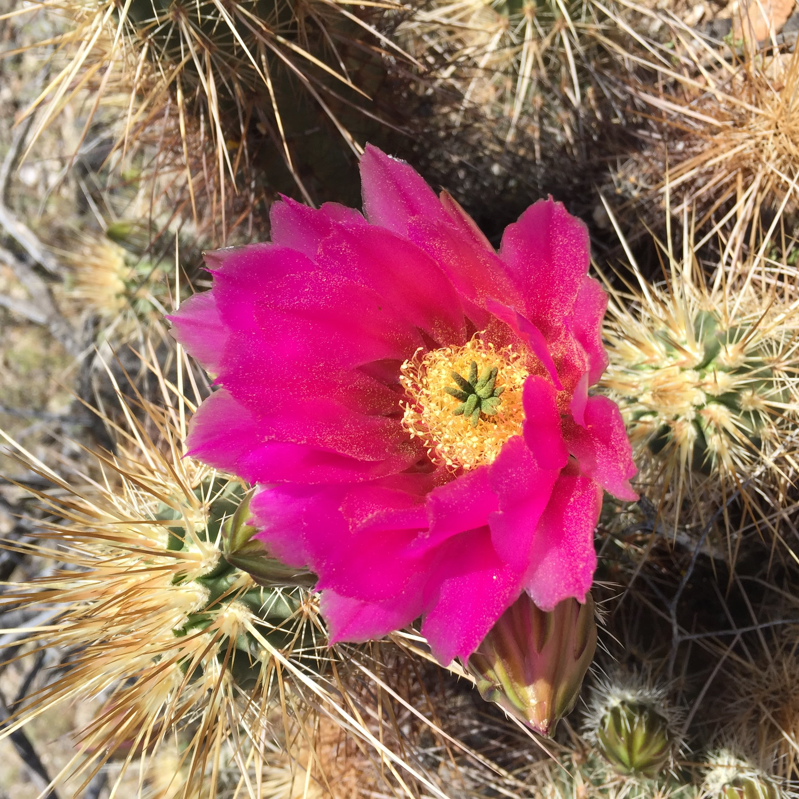
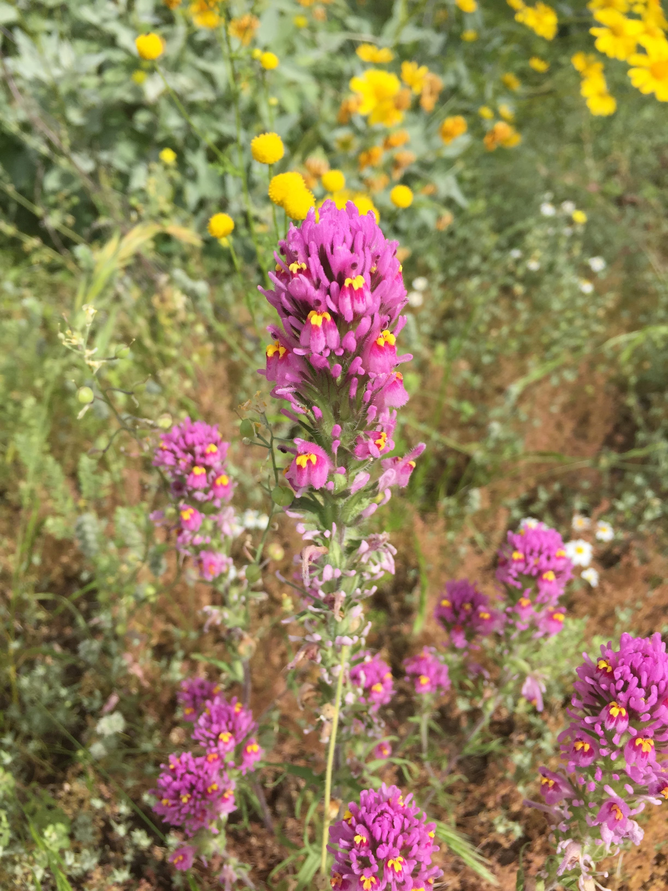

 
 

 
 

## How are plant communities in Phoenix residential yards changing and developing over time?

 

As part of my dissertation work, I am investigating how resident preferences are related to changes in their yard plant communities over the past ten years. With the assistance of many Phoenix residents, I'm conducting a social survey about changes made in yards and collecting data on actual yard plant community composition in 2008 and 2018. Stay tuned for updates and results!

 

 *Megan Wheeler - [Hall Lab](https://halllab.asu.edu/) - [ASU School of Life Sciences](https://sols.asu.edu/)* 

 *Updated `r Sys.Date()`* 
